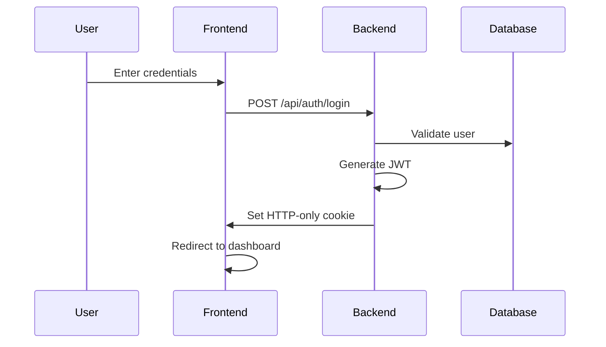

# CRM Application - Complete Documentation

A comprehensive Customer Relationship Management (CRM) system built with React 19, Node.js, Express, and PostgreSQL. This enterprise-grade application features advanced widget architecture, comprehensive audit logging, Microsoft 365 integration, and multi-tenant capabilities.

## 🚀 Features

- **Advanced Widget System**: Unified, configuration-driven widget architecture
- **Microsoft 365 Integration**: SSO authentication and email capabilities
- **Multi-tenant Architecture**: Company-scoped data isolation
- **Comprehensive Audit Logging**: Immutable audit trails with integrity verification
- **Full-text Search**: PostgreSQL-powered search across all entities
- **Real-time Notifications**: Event-driven notification system
- **File Management**: Secure file uploads and attachments
- **Dashboard Customization**: Drag-and-drop widget arrangement
- **Task & Ticket Management**: Integrated project management
- **Advanced Analytics**: Business intelligence and reporting

## 📋 Table of Contents

1. [Quick Start](#quick-start)
2. [Architecture Overview](#architecture-overview)
3. [Widget System](#widget-system)
4. [Authentication & Security](#authentication--security)
5. [Database Architecture](#database-architecture)
6. [API Documentation](#api-documentation)
7. [Deployment Guide](#deployment-guide)
8. [Development Guidelines](#development-guidelines)
9. [Troubleshooting](#troubleshooting)

## 🏃‍♂️ Quick Start

### Prerequisites

- Node.js (v14+)
- PostgreSQL (v12+)
- npm or yarn

### Environment Setup

1. **Clone the repository**
   ```bash
   git clone <repository-url>
   cd crm-app
   ```

2. **Set up environment variables**
   ```bash
   # Backend (.env)
   DB_HOST=localhost
   DB_PORT=5432
   DB_DATABASE=crm_db
   DB_USER=postgres
   DB_PASSWORD=your_password
   JWT_SECRET=your_jwt_secret
   
   # Frontend (.env)
   REACT_APP_API_URL=http://localhost:8080
   ```

3. **Install dependencies**
   ```bash
   # Backend
   cd backend && npm install
   
   # Frontend
   cd frontend && npm install
   ```

4. **Database setup**
   ```bash
   # Run migrations
   node backend/scripts/run-migration.js
   node backend/scripts/setup-widgets.js
   ```

5. **Start the application**
   ```bash
   # Backend (Terminal 1)
   cd backend && npm start
   
   # Frontend (Terminal 2) 
   cd frontend && npm start
   ```

6. **Access the application**
   - Frontend: http://localhost:3000
   - Backend API: http://localhost:8080

## 🏗️ Architecture Overview

### Technology Stack

**Frontend**:
- React 19 with React Router 7
- Tailwind CSS for styling
- React Grid Layout for dashboard
- Axios for HTTP requests
- Context API for state management

**Backend**:
- Node.js with Express 5
- Sequelize ORM with PostgreSQL
- JWT authentication with HTTP-only cookies
- Microsoft Graph API integration
- Comprehensive audit logging

**Database**:
- PostgreSQL with full-text search
- Snake_case schema with camelCase model conversion
- Company-scoped multi-tenant architecture
- Immutable audit logging system

**Deployment**:
- Frontend: AWS Amplify
- Backend: AWS Elastic Beanstalk
- Database: AWS RDS PostgreSQL

### Project Structure

```
crm-app/
├── backend/                 # Node.js Express API
│   ├── config/             # Database and app configuration
│   ├── middleware/         # Auth, upload, audit middleware
│   ├── models/             # Sequelize models (20+ entities)
│   ├── routes/             # API route definitions (18 modules)
│   ├── services/           # Business logic services
│   ├── scripts/            # Database migration scripts
│   ├── utils/              # Utility functions and helpers
│   └── widgets/            # External widget storage
├── frontend/               # React application
│   ├── public/            # Static assets
│   └── src/
│       ├── components/    # React components (40+ components)
│       ├── pages/         # Main application pages
│       ├── hooks/         # Custom React hooks
│       ├── context/       # React context providers
│       ├── config/        # Entity configurations
│       └── utils/         # Frontend utilities
├── db/                    # Database migrations
│   └── migrations/        # 16 sequential SQL migrations
└── docs/                  # Documentation files
```

## 🧩 Widget System

The CRM features a revolutionary unified widget system that reduces code duplication by 97% while providing consistent functionality across all entity types.

### Widget Architecture

#### 1. Unified Widget System (Current Standard)

**EntityWidget.js** (1,176 lines): Universal component handling all CRUD operations
- Generic data management for any entity type
- Advanced filtering and search capabilities
- Bulk operations and selection management
- List management integration
- Pagination with smart controls
- Undo delete functionality
- Tags system with keyboard input
- Modal-based forms with validation

**entityConfigs.js** (1,307 lines): Configuration hub for all entity types
- Contacts, leads, opportunities, companies, users, tasks, tickets
- Feature flags for toggleable functionality
- Field definitions for display and forms
- Filter configurations with dynamic options
- Custom actions and quick operations

#### 2. Wrapper Components

Thin wrapper components that consume EntityWidget:

```javascript
// UnifiedContactsWidget.js (35 lines)
import EntityWidget from './EntityWidget';
import { entityConfigs } from '../config/entityConfigs';

const UnifiedContactsWidget = ({ onOpenProfile }) => {
    return (
        <EntityWidget
            config={entityConfigs.contacts}
            onOpenProfile={onOpenProfile}
        />
    );
};
```

#### 3. Widget Types

1. **Built-in React Widgets**: Native components integrated into React app
2. **Built-in External Widgets**: File-based widgets in `/backend/widgets/buildin/`
3. **Custom Widgets**: User-uploaded widgets in `/backend/widgets/custom/`

### Creating New Widgets

#### Method 1: Unified Widget (Recommended)

1. **Add entity configuration**:
   ```javascript
   // entityConfigs.js
   myEntity: {
       title: 'My Entities',
       apiEndpoint: 'my-entities',
       features: {
           listManagement: true,
           bulkSelection: true,
           filtering: true,
           undoDelete: true
       },
       fields: {
           display: [
               { name: 'name', label: 'Name' },
               { name: 'status', label: 'Status', type: 'status' }
           ],
           form: [
               { name: 'name', type: 'text', required: true },
               { name: 'status', type: 'select', options: [...] }
           ]
       }
   }
   ```

2. **Create wrapper component**:
   ```javascript
   import EntityWidget from './EntityWidget';
   
   const UnifiedMyEntityWidget = ({ onOpenProfile }) => (
       <EntityWidget
           config={entityConfigs.myEntity}
           onOpenProfile={onOpenProfile}
       />
   );
   ```

3. **Register in database**:
   ```sql
   INSERT INTO widgets (widget_key, name, type, is_active)
   VALUES ('my-entity-widget', 'My Entity Widget', 'builtin-react', true);
   ```

#### Method 2: Custom External Widget

1. **Create widget directory**:
   ```
   /backend/widgets/custom/my-widget/
   ├── widget.json
   ├── index.js
   ├── styles.css
   └── assets/
   ```

2. **Widget manifest** (widget.json):
   ```json
   {
       "key": "my-widget",
       "name": "My Custom Widget",
       "version": "1.0.0",
       "entry": "index.js",
       "config": {}
   }
   ```

3. **Implementation** (index.js):
   ```javascript
   function initializeWidget(container, config) {
       // Widget logic
   }
   
   window.MyWidget = { init: initializeWidget };
   ```

### Widget Features

- **List Management**: Create and manage dynamic entity lists
- **Bulk Operations**: Select and operate on multiple items
- **Advanced Filtering**: Dynamic filter options with API integration
- **Tags System**: JSONB-based tagging with Enter key input
- **Custom Actions**: Configurable quick action buttons
- **Undo Delete**: Temporary deletion with restore capability
- **Search**: Real-time search with 300ms debounce
- **Pagination**: Server-side pagination with page controls

## 🔐 Authentication & Security

### Authentication Methods

#### 1. Standard Email/Password Authentication
- bcrypt password hashing with salt rounds (10)
- JWT tokens stored in HTTP-only cookies
- Session management with automatic cleanup
- "Remember me" functionality

#### 2. Microsoft 365 SSO Integration
- OAuth2 flow with Microsoft Graph API
- Automatic user and company creation
- Profile synchronization
- Email integration capabilities

### Authentication Flow



### Security Features

#### JWT Token Security
- HTTP-only cookies prevent XSS attacks
- Secure flag for HTTPS in production
- SameSite protection against CSRF
- Domain scoping for cookie security
- 24-hour token expiration

#### Role-Based Access Control
- Administrator: Full system access
- Sales Representative: Standard user access
- Custom roles: Company-configurable permissions

#### Company-Based Data Isolation
- All data scoped by `companyId`
- Automatic filtering in all queries
- Prevents cross-company data access
- User assignment within company boundaries

#### Comprehensive Audit Logging
- Immutable audit logs (insert-only)
- SHA-256 integrity verification
- IP address and user agent tracking
- Session duration monitoring
- Sensitive data classification
- Failed login attempt tracking

### Middleware Architecture

```javascript
// Authentication middleware chain
router.get('/protected', protect, authorize(['Administrator']), handler);

// Automatic audit logging
router.post('/create', protect, auditMiddleware, handler);
```

## 🗄️ Database Architecture

### Schema Overview

The database uses PostgreSQL with comprehensive indexing, full-text search, and automatic audit logging.

#### Core Tables

**Companies** (Multi-tenant root):
```sql
companies (
    id SERIAL PRIMARY KEY,
    name VARCHAR(255) NOT NULL,
    industry VARCHAR(255),
    ms365_client_id VARCHAR(255),  -- Microsoft integration
    email_enabled BOOLEAN DEFAULT false,
    created_at TIMESTAMP,
    updated_at TIMESTAMP
)
```

**Users** (Authentication):
```sql
users (
    id SERIAL PRIMARY KEY,
    username VARCHAR(50) UNIQUE NOT NULL,
    email VARCHAR(255) UNIQUE NOT NULL,
    password_hash VARCHAR(255) NOT NULL,
    role VARCHAR(255) DEFAULT 'Sales Representative',
    company_id INTEGER REFERENCES companies(id)
)
```

**Contacts** (CRM core):
```sql
contacts (
    id SERIAL PRIMARY KEY,
    first_name VARCHAR(255) NOT NULL,
    last_name VARCHAR(255) NOT NULL,
    email VARCHAR(255),
    phone VARCHAR(50),
    job_title VARCHAR(255),
    notes TEXT,
    status ENUM('active', 'inactive', 'prospect'),
    tags JSONB,
    company_id INTEGER REFERENCES companies(id),
    assigned_to INTEGER REFERENCES users(id)
)
```

#### Advanced Features

**Full-text Search Indexes**:
```sql
-- Contacts search index
CREATE INDEX idx_contacts_fulltext ON contacts USING gin(
    to_tsvector('english', 
        COALESCE(first_name, '') || ' ' || 
        COALESCE(last_name, '') || ' ' || 
        COALESCE(email, '') || ' ' || 
        COALESCE(notes, '')
    )
);
```

**Immutable Audit Logs**:
```sql
audit_logs (
    id SERIAL PRIMARY KEY,
    entity_type VARCHAR(50) NOT NULL,
    entity_id INTEGER,
    operation VARCHAR(20) NOT NULL,
    user_id INTEGER NOT NULL,
    field_name VARCHAR(100),
    old_value TEXT,
    new_value TEXT,
    ip_address INET,
    session_id VARCHAR(255),
    record_hash VARCHAR(64) NOT NULL,  -- SHA-256 integrity
    created_at TIMESTAMP DEFAULT CURRENT_TIMESTAMP
)
```

**Trigger Protection**:
```sql
-- Prevent audit log modification
CREATE OR REPLACE FUNCTION prevent_audit_modification()
RETURNS TRIGGER AS $$
BEGIN
    RAISE EXCEPTION 'Audit logs are immutable';
    RETURN NULL;
END;
$$ LANGUAGE plpgsql;
```

### Migration System

**Location**: `/db/migrations/`
**Execution**: Via Node.js scripts in `/backend/scripts/`

#### Migration Files (16 total):
1. `001_create_crm_tables.sql` - Core entities with full-text search
2. `002_add_email_configuration.sql` - Microsoft 365 integration
3. `003_create_widgets_table.sql` - Widget management system
4. `016_create_audit_system.sql` - Immutable audit logging

**Running Migrations**:
```bash
node backend/scripts/run-migration.js
node backend/scripts/setup-widgets.js
node backend/scripts/run-dashboard-migration.js
```

### Database Features

- **Snake Case Conversion**: Automatic field name translation (database: `first_name` ↔ model: `firstName`)
- **Company Scoping**: All queries automatically filtered by company
- **Automatic Timestamps**: `updated_at` triggers on all tables
- **JSONB Support**: Flexible data with GIN indexing
- **Constraint Validation**: Comprehensive data integrity checks
- **Connection Pooling**: Optimized for high concurrency

## 📡 API Documentation

### RESTful Architecture

The API follows consistent RESTful patterns across 18 route modules with comprehensive authentication, authorization, and audit logging.

#### Base URL Structure
```
/api/{module}/{endpoint}
```

#### Authentication Patterns
```javascript
// Basic authentication
router.get('/', protect, handler);

// Admin-only access
router.delete('/:id', protect, authorize(['Administrator']), handler);

// Automatic company scoping
whereClause.companyId = req.user.companyId;
```

### Core Endpoints

#### Authentication
- `POST /api/auth/login` - Standard email/password login
- `POST /api/auth/register` - User registration with company creation
- `GET /api/auth/microsoft/login` - Microsoft SSO initiation
- `POST /api/auth/logout` - Session termination with audit

#### Core Entities
- `GET /api/contacts` - Paginated contact list with filtering
- `POST /api/contacts` - Create contact with automatic audit
- `PUT /api/contacts/:id` - Update contact with change tracking
- `DELETE /api/contacts/:id` - Soft delete with undo capability

#### Advanced Features
- `GET /api/search` - Cross-entity full-text search
- `GET /api/contacts/filter-options` - Dynamic filter options
- `POST /api/contacts/bulk-create` - Bulk operations
- `GET /api/audit-logs` - Audit trail with sensitive data protection

### Request/Response Patterns

#### Standard List Response
```json
{
    "items": [...],
    "pagination": {
        "currentPage": 1,
        "totalPages": 10,
        "totalItems": 200,
        "itemsPerPage": 20
    }
}
```

#### Error Response
```json
{
    "success": false,
    "message": "Operation failed",
    "error": "Detailed error message"
}
```

### Filtering & Search

#### Query Parameters
```javascript
GET /api/contacts?search=john&status=active&page=1&limit=20&sortBy=created_at&sortOrder=DESC
```

#### Advanced Search
```javascript
// Multi-field search
if (search) {
    whereClause[Op.or] = [
        { firstName: { [Op.iLike]: `%${search}%` } },
        { lastName: { [Op.iLike]: `%${search}%` } },
        { email: { [Op.iLike]: `%${search}%` } }
    ];
}
```

### Audit Integration

Every API operation includes automatic audit logging:
```javascript
const contact = await Contact.create(data, getAuditContext(req));
await contact.update(data, getAuditContext(req));
```

## 🚀 Deployment Guide

### Production Architecture

**Frontend**: AWS Amplify
- Custom domain: `https://crm.svnikolaturs.mk`
- Build domain: `https://main.dww6vb3yjjh85.amplifyapp.com`
- CDN distribution
- Automatic SSL

**Backend**: AWS Elastic Beanstalk
- Node.js application environment
- Auto-scaling and load balancing
- Environment variable management
- Health monitoring

**Database**: AWS RDS PostgreSQL
- SSL encryption enabled
- Automated backups
- High availability

### Environment Variables

#### Production Backend
```bash
DB_HOST=your-rds-endpoint.region.rds.amazonaws.com
DB_PORT=5432
DB_DATABASE=crm_production
DB_USER=crm_user
DB_PASSWORD=secure_password
JWT_SECRET=production_jwt_secret
NODE_ENV=production
```

#### Production Frontend
```bash
REACT_APP_API_URL=https://your-backend-domain.com
PUBLIC_URL=https://crm.svnikolaturs.mk
```

### Deployment Process

#### Frontend (AWS Amplify)
1. Build: `cd frontend && npm run build`
2. Deploy via Amplify console or CLI
3. Configure custom domain and SSL

#### Backend (AWS Elastic Beanstalk)
1. Package: `cd backend && zip -r app.zip .`
2. Deploy via EB console or CLI
3. Configure environment variables
4. Run database migrations: `node backend/scripts/run-migration.js`

### Health Checks

- **Basic Health**: `GET /` - Application status
- **Database Health**: `GET /api/test-db` - Database connectivity

### Security Configuration

#### CORS Settings
```javascript
const allowedOrigins = [
    'https://main.dww6vb3yjjh85.amplifyapp.com',
    'https://crm.svnikolaturs.mk',
    'http://localhost:3000'  // Development only
];
```

#### SSL Configuration
- Database connections require SSL
- JWT cookies secured in production
- All production traffic over HTTPS

## 💻 Development Guidelines

### Code Standards

#### Frontend Components
- Use React 19 features and hooks
- Implement React.memo for performance
- Use useCallback for event handlers
- Follow Tailwind CSS utility classes
- Implement proper loading states

#### Backend Patterns
- Use Sequelize models with associations
- Implement audit hooks on all models
- Company-scope all data queries
- Use proper error handling
- Follow RESTful conventions

### Component Structure

```javascript
const MyComponent = React.memo(({ prop1, prop2 }) => {
    const [state, setState] = useState(initialState);
    
    const handleAction = useCallback((param) => {
        // Action logic
    }, [dependencies]);
    
    if (loading) return <LoadingSpinner />;
    if (error) return <ErrorMessage error={error} />;
    
    return (
        <div className="tailwind-classes">
            {/* Component content */}
        </div>
    );
});
```

### API Route Pattern

```javascript
router.get('/', protect, async (req, res) => {
    try {
        const { page = 1, limit = 20, search } = req.query;
        
        const whereClause = { companyId: req.user.companyId };
        
        if (search) {
            whereClause[Op.or] = [
                // Search conditions
            ];
        }
        
        const { count, rows } = await Model.findAndCountAll({
            where: whereClause,
            include: [/* associations */],
            order: [['created_at', 'DESC']],
            limit: parseInt(limit),
            offset: (page - 1) * limit
        });
        
        res.json({
            items: rows,
            pagination: {
                currentPage: parseInt(page),
                totalPages: Math.ceil(count / limit),
                totalItems: count
            }
        });
    } catch (error) {
        console.error('Operation error:', error);
        res.status(500).json({ message: 'Operation failed' });
    }
});
```

### Database Best Practices

1. **Always use company scoping**:
   ```javascript
   where: { companyId: req.user.companyId }
   ```

2. **Implement audit hooks**:
   ```javascript
   addAuditHooks(Model, 'entity_type', {
       sensitiveFields: ['email', 'phone']
   });
   ```

3. **Use proper associations**:
   ```javascript
   Contact.belongsTo(Company, { foreignKey: 'companyId' });
   Contact.belongsTo(User, { foreignKey: 'assignedTo', as: 'assignedUser' });
   ```

### Performance Optimization

1. **Frontend**:
   - Use React.memo and useMemo appropriately
   - Implement virtual scrolling for large lists
   - Debounce search inputs (300ms)
   - Lazy load components

2. **Backend**:
   - Use selective attribute loading
   - Implement proper database indexes
   - Use connection pooling
   - Cache frequently accessed data

3. **Database**:
   - Index all foreign keys
   - Use GIN indexes for JSONB fields
   - Implement full-text search indexes
   - Monitor query performance

## 🔧 Troubleshooting

### Common Issues

#### Database Connection
**Problem**: Cannot connect to database
**Solution**:
1. Verify environment variables are set
2. Check PostgreSQL is running
3. Test connection: `GET /api/test-db`
4. Verify SSL settings for production

#### Widget Loading
**Problem**: Widgets not loading properly
**Solution**:
1. Check widget manifest files are valid JSON
2. Verify widget files exist in correct directories
3. Clear browser cache
4. Check console for JavaScript errors

#### Authentication Issues
**Problem**: JWT authentication failing
**Solution**:
1. Verify JWT_SECRET is set
2. Check cookie settings for CORS
3. Ensure frontend API_URL is correct
4. Verify user has proper role permissions

#### Search Not Working
**Problem**: Full-text search returning no results
**Solution**:
1. Check PostgreSQL full-text indexes exist
2. Verify search terms are properly escaped
3. Test search directly on database
4. Rebuild search indexes if necessary

### Performance Issues

#### Slow Dashboard Loading
**Causes**:
- Too many widgets loading simultaneously
- Large datasets without pagination
- Missing database indexes
- Inefficient queries

**Solutions**:
1. Implement lazy loading for widgets
2. Add proper pagination
3. Add database indexes for frequent queries
4. Optimize Sequelize associations

#### Memory Issues
**Causes**:
- Large result sets loaded into memory
- Connection pool exhaustion
- Memory leaks in React components

**Solutions**:
1. Implement server-side pagination
2. Configure connection pool limits
3. Use React DevTools to identify memory leaks
4. Implement proper cleanup in useEffect

### Development Setup Issues

#### Node Modules
```bash
# Clear and reinstall
rm -rf node_modules package-lock.json
npm install
```

#### Database Reset
```bash
# Reset database and run migrations
DROP DATABASE crm_db;
CREATE DATABASE crm_db;
node backend/scripts/run-migration.js
```

#### Cache Issues
```bash
# Clear all caches
npm start -- --reset-cache  # React
rm -rf .next  # If using Next.js
```

### Debugging Tools

#### Backend Debugging
```javascript
// Enable Sequelize logging
logging: console.log  // In db config

// Add debug middleware
app.use((req, res, next) => {
    console.log(`${req.method} ${req.path}`, req.body);
    next();
});
```

#### Frontend Debugging
```javascript
// React DevTools
// Redux DevTools (if using Redux)
// Console logging
console.log('Debug info:', data);
```

### Monitoring

#### Application Health
- Monitor `/api/test-db` endpoint
- Check error logs in Elastic Beanstalk
- Monitor database connection pool
- Track API response times

#### Security Monitoring
- Monitor failed login attempts in audit logs
- Check for unusual session patterns
- Monitor file upload attempts
- Track admin operations

---

## 📄 License

[Your License Here]

## 🤝 Contributing

[Contributing Guidelines Here]

## 📞 Support

For technical support or questions:
- Check the troubleshooting section above
- Review the CLAUDE.md file for development guidance
- Contact the development team

---

*This documentation is comprehensive and covers all aspects of the CRM application. For specific implementation details, refer to the individual section guides within this documentation.*